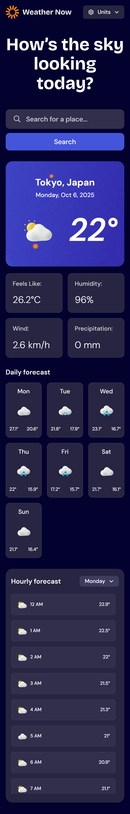
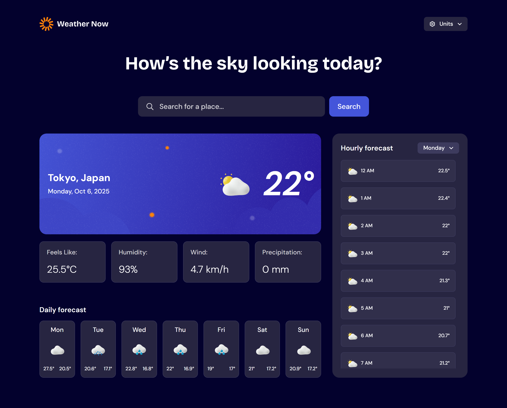

# Frontend Mentor - Weather app solution

This is a solution to the [Weather app challenge on Frontend Mentor](https://www.frontendmentor.io/challenges/weather-app-K1FhddVm49) built using React.js, TanStack Query (formerly React Query) and Redux Toolkit. Frontend Mentor challenges help you improve your coding skills by building realistic projects.

## Table of contents

- [Overview](#overview)
  - [The challenge](#the-challenge)
  - [Screenshot](#screenshot)
  - [Links](#links)
- [My process](#my-process)
  - [Project structure](#project-structure)
  - [Built with](#built-with)
  - [What I learned](#what-i-learned)
  - [Continued development](#continued-development)
  - [Useful resources](#useful-resources)
- [Author](#author)
- [Credits](#credits)

## Overview

### The challenge

Users are able to:

- Search for weather information by entering a location in the search bar
- View current weather conditions including temperature, weather icon, and location details
- See additional weather metrics like "feels like" temperature, humidity percentage, wind speed, and precipitation amounts
- Browse a 7-day weather forecast with daily high/low temperatures and weather icons
- View an hourly forecast showing temperature changes throughout the day
- Switch between different days of the week using the day selector in the hourly forecast section
- Toggle between Imperial and Metric measurement units via the units dropdown
- Switch between specific temperature units (Celsius and Fahrenheit) and measurement units for wind speed (km/h and mph) and precipitation (millimeters) via the units dropdown
- View the optimal layout for the interface depending on their device's screen size
- See hover and focus states for all interactive elements on the page

### Screenshot




### Links

- Solution URL: [GitHub](https://github.com/ania221B/weather-app)
- Live Site URL: [GitHub Pages](https://ania221b.github.io/weather-app/)

## My process

### Project Structure

📁 src/

├── apis/                      # Axios instances & data fetching functions

├── app/                      # Redux Toolkit store

├── assets/                      # Images, icons & fonts

|  ├── fonts/

|  ├── icons/

|  └── images/

├── components/                  # Shared UI and feature components

│  ├── common/                    # Generic, cross-project components (e.g. Modal)

├── favourites/                    # Components that make the favourites system (FavouriteButton, FavouriteList)

├── icons/                     # Icons made into components

│  ├── layout/                    # Layout-related components (e.g. Header)

│  ├── lists/                     # Reusable list-related components

│  ├── sections/                  # Page-specific or grouped content sections

│  └── ui/                        # Small building blocks (e.g. CartItem, ProductCard)

├── features/                   # Redux Toolkit slices

├── hooks/                   # Custom React hooks

├── sass/                        # SCSS partials and global styles

│ ├── abstracts/                # Variables, mixins, functions

│ ├── base/                      # Reset, general styles

│ ├── components/                # Elements with their own styles, like buttons, inputs, cards, etc.

│ ├── layout/                    # Generic styling creating layouts

│ ├── utilities/                 # Classes that do one specific thing

│ └── vendor/                    # Third party CSS

├── App.jsx                      # Top-level UI component, sets up routes and suspense boundaries

├── index.scss                   # Entry point that imports all styles

└── main.jsx                     # React root

### Built with

- Semantic HTML5 markup
- CSS custom properties
- Flexbox
- CSS Grid
- SCSS
- Mobile-first workflow
- [React](https://reactjs.org/) - JS library
- [TanStack Query](https://tanstack.com/query/latest) - Data fetching library
- [Redux Toolkit](https://redux-toolkit.js.org) - For state management

### What I learned

#### Retry button

Part of the challenge was building an error screen with retry button. I used TanStack Query for this project. `useQuery` has a `retry` parameter and returns a `refetch` function. Using the `retry` parameter, you can tell TanStack Query what to do when there is an error. I relied on that to give the user the option to manually triger a refetch with a button:

```jsx
import { useQuery } from '@tanstack/react-query'
import { fetchLocation } from '../apis'
import { normalizeLocations } from '../utils'

function useLocationSearch(location) {
  const { data, isPending, error, refetch } = useQuery({
    queryKey: ['locations', location.toLowerCase()],
    queryFn: () => {
      if (!location || location.length < 3) return []
      return fetchLocation(location)
    },
    select: normalizeLocations,
    enabled: !!location && location.length >= 3,
    retry: (failureCount, error) => {
      if (error.response?.status === 400) {
        return false
      }
      return failureCount < 3
    }
  })

  return { data, isPending, error, refetch }
}
export default useLocationSearch
```

As stated in Open-Meteo API:

> In case an error occurs, for example a URL parameter is not correctly specified, a JSON error object is returned with a HTTP 400 status code.

In the `useLocationSearch` hook above the piece of code shown below tells the TanStack query to not attempt fetching the data when there was an invalid query, but try 3 times in other cases, like a connection problem, or anything else that is likely to be temporary, to try 3 times:

```js
retry: (failureCount, error) => {
  if (error.response?.status === 400) {
    return false
  }
  return failureCount < 3
}
```

Since you get the `refetch` function, you can use it for the button, for example like this:

```jsx
import useWeatherSearch from './hooks/useWeatherSearch'

const {
    data: weather,
    isPending: loadingWeather,
    error: weatherError,
    refetch: refetchWeather
  } = useWeatherSearch(coordinates, units)

 <button type='button' className='btn btn--error' onClick={() => refetchWeather())}>
    <span>Retry</span>
  </button>
```

#### `select` Parameter

The `select` parameter lets you manipulate the data received from the query. I used it to normalize the output returned. In the `useLocationSearch` hook from from [Retry button](#retry-button) section, the following piece of code ensures the data from the query is subsequently normalized using `normalizeLocations` utility function:

```jsx
    select: normalizeLocations,
```

Below is the function I used to normalize the location data. Having such utility to use on returned data is a practice I follow to avoid unnexpected errors should the server return something "weird":

```js
function normalizeLocations(locations) {
  if (!locations) return []
  return locations?.map(location => {
    return {
      id: Number.isInteger(location?.id) ? location.id : 0,
      name: typeof location?.name === 'string' ? location.name : '',
      country: typeof location?.country === 'string' ? location.country : '',
      latitude: typeof location?.latitude === 'number' ? location.latitude : 0,
      longitude:
        typeof location?.longitude === 'number' ? location.longitude : 0
    }
  })
}

export default normalizeLocations
```

#### `enabled` Parameter

The `enabled` parameter helps you control when the query is made. Since the API used says:

> String to search for. An empty string or only 1 character will return an empty result. 2 characters will only match exact matching locations. 3 and more characters will perform fuzzy matching. The search string can be a location name or a postal code.

I decided that the query should't run on empty strings and these shorter than 3 characters. In the `useLocationSearch` from [Retry button](#retry-button) section:

```js
    queryFn: () => {
      // same check as for `enabled` parameter for extra safety
      if (!location || location.length < 3) return []
      return fetchLocation(location)
    },
    // query isn't made when there is no input or the input is shorter than 3 characters
    enabled: !!location && location.length >= 3,
```

#### Custom dropdown

To build a custom dropdown you need:

1. main container
2. a button that opens and closes the dropdown
3. a list with options to choose from

The button needs the following attributes:

- `role='combobox'` - this means this button controls another element that shows up dynamically so that user can select a value
- `aria-expanded` - this needs to be `true` or `false` depending on whether the dropdown is open or not
- `aria-haspopup='listbox'` - tells assistive technologies that the element opens a listbox
- `aria-controls` - this needs to be the id of the element controled by the button, in this case the list
- `aria-activedescendant` - this needs to be the id of the option element that is currently active/selected

The list needs the following attributes:

- `id` - necessary for the `aria-controls` attribute of the button controling the state of the list
- `role='listbox'` - identifies the element as a list from which users can select a value
- `aria-label`- to provide more information about what list options you can choose from

The list items need the following attributes:

- `role='option'` - identifies the item as an option user can pick
- `aria-selected` - tells if the option is selected or not

```jsx
function CustomSelect() {
  const [isDropdownOpen, setIsDropdownOpen] = useState(false)
  const [selectedOptionIndex, setSelectedOptionIndex] = useState(0)
  const list = [
    'Monday',
    'Tuesday',
    'Wednesady',
    'Thursday',
    'Friday',
    'Saturday',
    'Sunday'
  ]

  return (
    <div>
      <button
        type='button'
        role='combobox'
        aria-controls='option-list'
        aria-expanded={isDropdownOpen}
        aria-activedescendant={`option-{selectedOptionIndex}`}
      >
        Selected Option
      </button>
      {isDropdownOpen && (
        <ul
          id='option-list'
          role='listbox'
          aria-label='Pick option to change display'
        >
          {list.map((item, index) => {
            return (
              <li
                role='option'
                aria-selected={index === selectedOptionIndex || undefined}
              >
                {item}
              </li>
            )
          })}
        </ul>
      )}
    </div>
  )
}
```

#### Search with suggestion list

The pattern is basically the same as for custom dropdown but instead of the button, there's an input with the same set of attributes with the addition of `aria-autocomplete`, so:

- `role='combobox'`
- `aria-controls`
- `aria-expanded`
- `aria-haspopup`
- `aria-activedescendant`
- `aria-autocomplete`

Since the content of the suggestion list is changing dynamically, a good idea is to use `aria-live='polite'`

```js
function SearchBar () {
  const [isExpanded, setIsExpanded] = useState(false)
  const [selectedOptionIndex, setSelectedOptionIndex] = useState(0)
  const suggestions = ['london', 'warsaw', 'paris', 'berlin', 'seoul']

<search>
    <form>
      <div>
        <label htmlFor='search-input'>Search a place</label>

        <input
          id='search-input'
          type='text'
          role='combobox'
          aria-expanded={isExpanded}
          aria-controls='suggestion-list'
          aria-haspopup='listbox'
          aria-autocomplete='list'
          aria-activedescendant={`option-${selectedOptionIndex}` || undefined}
        />
          <ul
      id='suggestion-list'
      role='listbox'
      aria-label='Search suggestions'
      aria-live='polite'
    >
      {suggestions.map((location, index) => {
        return (
          <SuggestionsListItem
            key={location.id}
            suggestion={location}
            index={index}
            selectedOptionIndex={selectedOptionIndex}
            onSelect={onSelect}
          ></SuggestionsListItem>
        )
      })}
    </ul>
      </div>

      <button type='submit'>
        Search
      </button>
    </form>
</search>
}
```

#### Tools menu

I decided to use the ARIA menubar pattern for the tools menu, which contains buttons for things like showing the favourite list, comparison view, and details view. At the moment only the favourites button is implemented, yet it is not used in tha App as I am not yet happy with the result.

The basic ARIA menubar structure looks like this:

You need a list element with the role of `menu`. List items get the role of `none`. Inside the list element there should be the element with the role of `menuitem`, in my case these are buttons:

```js
<ul role='menu'>
  <li role='none'>
    <button type='button' role='menuitem'>
      <span>Favourite List</span>
    </button>
  </li>

  <li role='none'>
    <button type='button' role='menuitem'>
      <span>Comparison view</span>
    </button>
  </li>
</ul>
```

I am not entirely sure whether a menubar is the most appropriate pattern for this case — it works technically, but it might be more semantically correct to use a simpler navigation pattern. For now I’ve left it like this, but I may revisit later if I find a clearer accessibility guideline.

### Continued development

- Redux Toolkit – I used this challenge to practice Redux Toolkit beyond a simple cart + modal setup. I’d like to keep learning more about this tool.
- React Query – I know Redux Toolkit has tools for data fetching, but I chose React Query here to get more practice, since it’s still fairly new to me.
- Layout techniques – It was tricky to find exact values for media queries. I watched [Use this instead of media queries or container queries](https://youtu.be/LEkFckg7sfw?si=Vf7lVO_ZoMfCCIdM) by Kevin Powell on alternatives and consider exploring more modern approaches.
- SCSS organization – I’d like to develop a clearer system, so it's easier for me to decide where styles belong.
- Accessible UI patterns – Dropdowns, search bars, and menus involve many ARIA attributes. I want more practice so that accessibility feels more natural instead of something I need to double-check each time.

### Useful resources

- These two articles helped me to build cutsom dropdowns. The first one uses plain JavaScript, the second one implements the same with React.js:
  - [Creating a custom `<select>` dropdown with CSS](https://blog.logrocket.com/creating-custom-select-dropdown-css)
  - [How to Build a Dynamic Dropdown Component in React – React Compound Component Pattern Explained](https://www.freecodecamp.org/news/build-a-dynamic-dropdown-com)
- [nnnoise](https://www.fffuel.co/nnnoise) - I used this tool to generate grainy background used on loading screen

## Author

- Frontend Mentor - [@ania221b](https://www.frontendmentor.io/profile/ania221b)

## Credits

- This solution was made using a template I build while taking [Beyond CSS](https://www.beyondcss.dev/) course by [Kevin Powell](https://www.kevinpowell.co/). You can find Kevin's template on [his GitHub](https://github.com/kevin-powell)
- Weather date powered by [Open-Meteo API](https://open-meteo.com/).
- Additional icons - not included in challenge assets - provided by [Lucide](https://lucide.dev)
